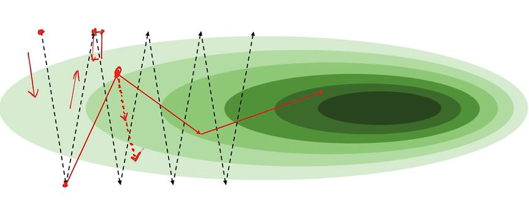
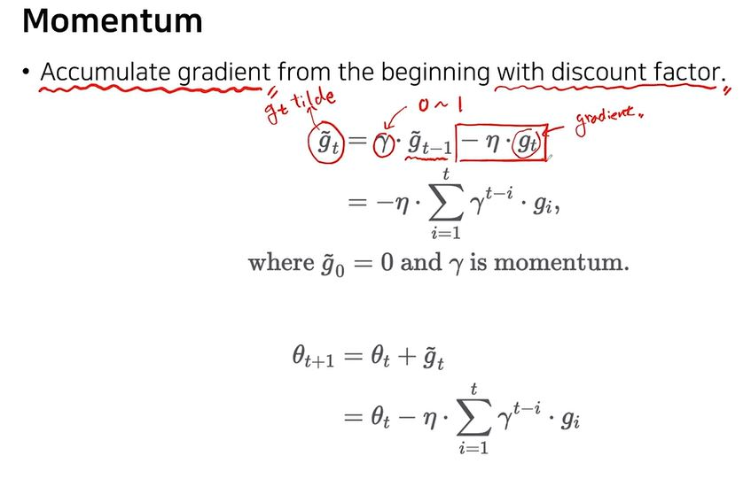

# Momentum
### : Momentum은 빠른학습속도와 local minima를 문제를 개선하고자 SGD에 관성의 개념을 적용했다.

- Stochastic Gradient Descent : 검은색 점선 | Momentum : 빨간선
- 기존 SGD는 전체 GD를 랜덤으로 일부만 반영하기 때문에 Batch_size의 크기와 noise가 반비례한다. 하지만 Momentum은 이전의 GD도 반영하기 때문에 누적되어서 noise가 상쇄된다. local minimum에 도달하는 속도는 SGD보다 빠르지만 관성에 의해 local minimum에 튕겨서 돌아온다.

<blockquote> 수식은 위와 같다. g_tilde : 관성계수와 이전 g_tilde의 곱에서 LR와 Gradient의 곱을 빼준다.다음 Θ는 현재 Θ와 g_tilde를 더해서 업데이트 한다.